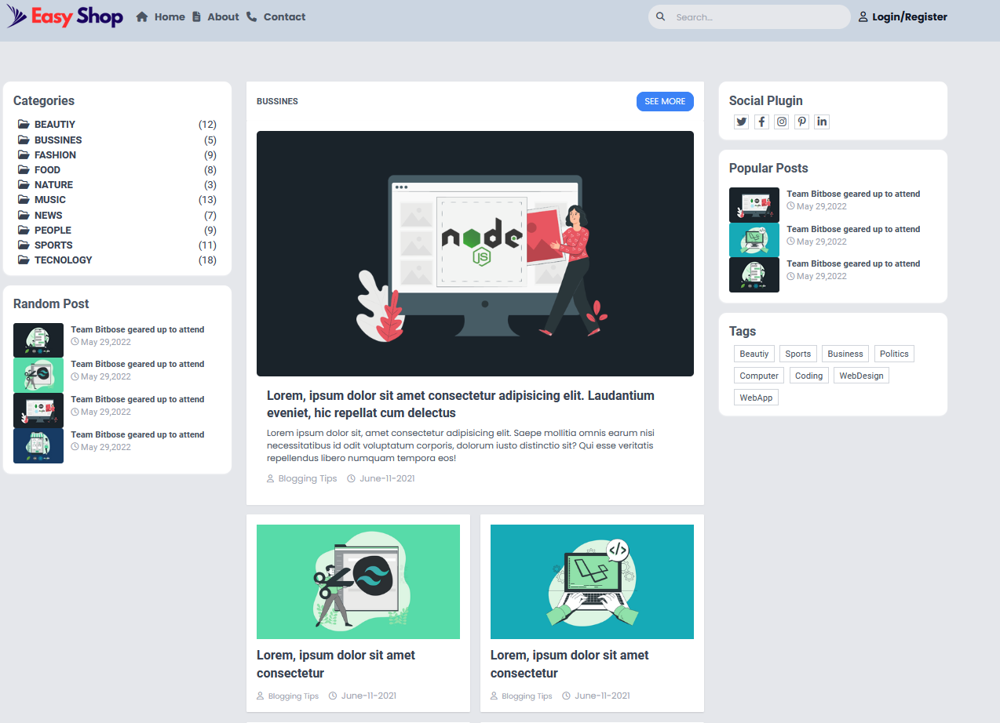
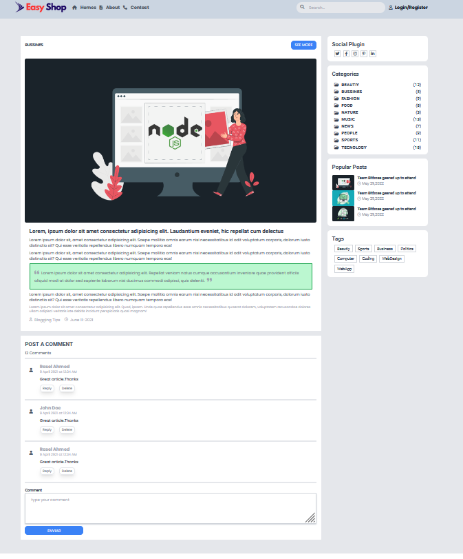

<p align="center">
  <a href="" rel="noopener">
  </a>
</p>

<h3 align="center">Blog simples EasyShop</h3>

<div  align="center" >

[]() [](https://github.com/rogeriopio/blog-EasyShop/issues) [](https://github.com/rogeriopio/blog-EasyShop/pulls) [](/LICENSE)

</div>

---

<p align="center"> Blog simples realizado para treinar Tailwindcss
    <br> 
</p>

## 📝 Tabelas de Conteudo

-   [Sobre](#sobre)
-   [Inciando o Projeto](#iniciando-o-projeto)
-   [ Como este projeto funciona](#como-este-projeto-funciona)
-   [Tecnologia Utilizada](#tecnologia-utilizada)
-   [Autor](#Autor)

## 🧐 Sobre

### O que é este projeto

<p>Simples blog feito em HTML,TailwindCss e JS, criada para treinar logica e conceitos</p>

Site online:https://blogeasyshop.netlify.app/

## 🏁 Iniciando o projeto

Como instalar o projeto

### Pré-requisitos

Antes de começar você vai precisar ter instalado em sua maquina as seguintes ferramentas:

-   [VSCode](https://code.visualstudio.com/)
-   [Git](https://git-scm.com)
-   [Node.js](https://nodejs.org/en/)
-   [Extensão LiveServer VsCode](https://marketplace.visualstudio.com/items?itemName=ritwickdey.LiveServer)

```
# Clone este repositório
$ git clone https://github.com/rogeriopio/blog-EasyShop.git

# Acesse a pasta do projeto no terminal/cmd
$ cd blog

# Instale as dependências
$ npm install

# Rode o comando para deixar o Tailwind em rodando em background
$ npm run watch
```

## 🔧 Como este projeto funciona?

<p>Possui apenas duas telas </p>

</a>
</a>

## Tecnologia Utilizada

As seguintes ferramentas foram usadas na construção do projeto:

-   [](https://developer.mozilla.org/pt-BR/docs/Web/CSS)
-   [](https://developer.mozilla.org/pt-BR/docs/Web/HTML)

-   [](https://developer.mozilla.org/pt-BR/docs/Web/JavaScript)
-   [](https://tailwindcss.com/)

## ✍️ Autor

Feito por [@rogeriopio](https://github.com/rogeriopio/) 👋🏽 Entre em contato!

[](https://twitter.com/rogerioxpio) [](https://www.linkedin.com/in/rogerioxpio/)
[](mailto:rogerioxpio@gmail.com)
